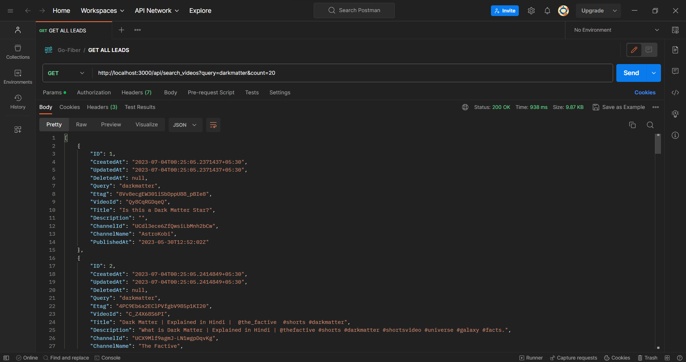
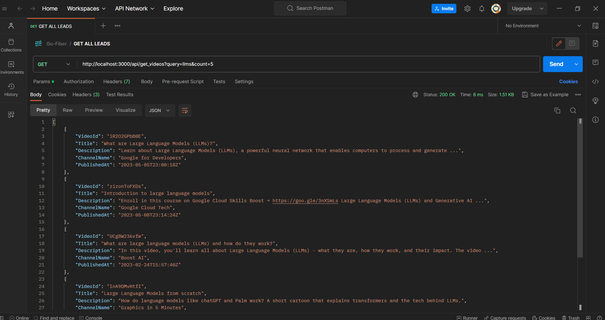

# Youtube API Server
## Overview 
This launches a golang server locally that can fetch videos using youtube-api and stores the results in a database(mysql). Before adding the item it checks if the item already exists and whether its etag has changed nor not. If it has changed then it updates the required changes else adds the new item to the database.

## Examples
### Searching Video 
` http://localhost:3000/api/search_videos?query=<YOUR_QUERY>&count=<ITEM_COUNT> `
 
 

### Fetching Videos
` http://localhost:3000/api/get_videos?query=<YOUR_QUERY>&count=<ITEM_COUNT> `
 
 

